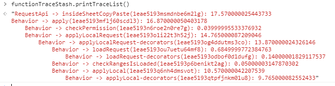
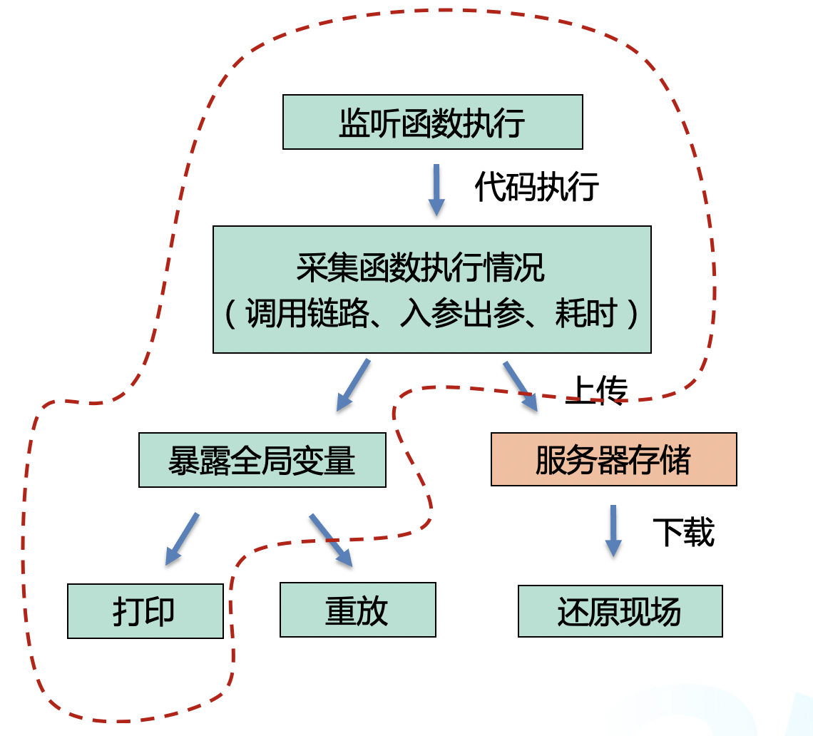
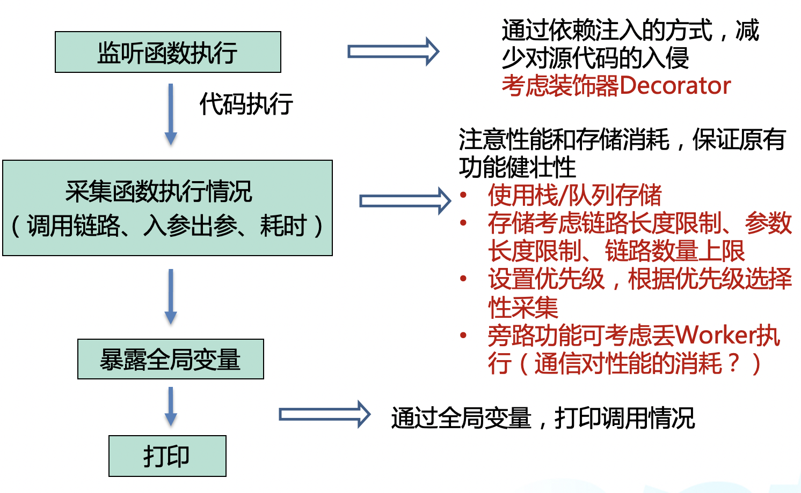
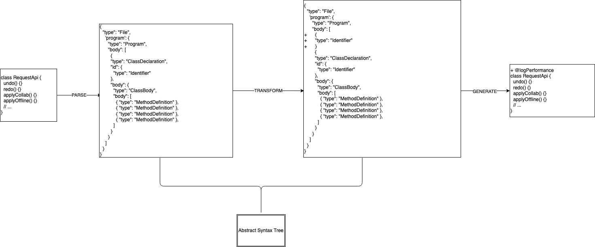

# 大型前端项目要怎么跟踪和分析函数调用链

## 方案设计

简单做一个函数耗时分析的功能还是比较简单的，写代码也是比较容易的一部分。但如果让一个功能真正发挥它的价值，前期方案的设计和分析也是很重要的。

## 现状

一般来说，对于大型项目或是新人加入，维护过程（熟悉代码、定位问题、性能优化等）比较痛的有以下问题：

- 函数执行情况黑盒
  - 函数调用链不清晰
  - 函数耗时不清楚
  - 代码异常定位困难
- 用户行为难以复现

要是遇到代码稍微复杂点，事件比较多、函数调用也特别多的，即使使用断点也能看到眼花，蒸汽眼罩都得多买一些（真的贵啊）。生活本来就比较难了，身为技术人的我们得用技术去提升下自身的生活和工作体验呀。

回到上面说到的现状，函数执行黑盒这块相信大家都比较容易考虑到，而在日常的问题定位中，很多情况下我们需要查用户的问题，但是用户的反馈常常表达上会和我们理解的不一致。那如果能直接还原用户的操作，那岂不是棒棒哒？

目标
那既然现状有了，我们可以根据自己的需要，把目标确定下来。

> 个人觉得，即使是技术人员，前期的目标和现状分析也是很重要的。我们常常会遇到很多项目进行到一半发现和预期不一致、需要重新返工甚至只能放弃，往往是因为前期做的调研不充分，考虑到的情况还不够多。综上，设计的部分也需要好好去做，至于具体的方式，是手稿、文字、流程图、还是 PPT，可以根据个人喜好去选择。

那么，我先来拆分下自己想要的功能是什么样子的：

- 基础能力
  - 单个函数执行情况：函数名、入参、出参、耗时
  - 全局辅助信息：函数调用链、调用次数统计
- 便捷接入
  - 不改动源码
- 易拓展
  - 可重放功能
  - 可保存到服务器

首先，基本功能必不可少，主要包括函数的一些执行情况，例如调用链、函数名、类名、入参出参，还有性能分析相关的，包括耗时、函数调用次数的统计等。这些在我们分析和定位问题的时候，能派上不少的用场。

其次，对于这部分功能代码，需要满足易用性，包括易接入、易拓展等。易接入主要考虑不需要改动源代码，这也是代码设计中比较基础的要求了。易拓展则预留给后续想要在现有功能基础上添加新功能的时候，会相对简便。

## 整体方案设计

方案设计也不算复杂，基本上就是结合目标，然后以自己最熟练的方向作为起点，一点点把完整的功能视图补全。最后，再回顾下前面的现状和目标，分析设计出来的方案是否有脱离实际需要（有时候我们的脑补能力很强大，容易飘离本意）。

说起函数，最简单的就是给每个想要检测的函数包裹一层，除了调用原有的功能以外，新增对函数的一些数据采集，包括上面说到的单个函数执行信息和全局的辅助信息等。

要怎么方便地使用这些信息呢？我们可以通过堆栈的方式存下来，然后对这些信息进行处理来获取调用链、耗时等。通常来说，可以暴露全局变量的接口，来快速打印输出这些信息。

我们来看看设计方案：

这里，将函数重放和上传服务器的优先级降低，先实现核心功能。工作内容的拆分、工作量的预估这些也都是方案设计中比较重要的部分，将大目标拆分成一个个小目标，这样对整体节奏、实现过程的把控会更有力。

方案细节设计
整体方案初步定了，我们需要考虑每个环节的细节方案。以一期的功能为主，流程包括以下：

1. 监听函数执行。
2. 采集函数执行情况：（调用链路、入参出参、耗时）。
3. 暴露全局变量或 API。
4. 使用全局变量或 API 打印调用链等。

由于这是一个非关键链路的功能，除了怎样的功能更方便使用以外，主要考虑这样的旁路功能不能影响主要功能的性能、不能因为一些异常导致正常功能无法使用。因此我们需要对每个流程进行一些分析和考虑：

- 监听函数执行
  - 可通过依赖注入的方式，减少对源代码的入侵
  - 代码实现多基于 Class，可考虑装饰器 Decorator 的方式
- 采集函数执行情况
  - 需要注意性能和存储消耗，保证原有功能健壮性
  - 考虑使用栈来存储
    - 存储考虑链路长度限制、参数长度限制、链路数量上限
  - 设置优先级，根据优先级选择性采集
  - 旁路功能可考虑丢 Worker 执行
    - 考虑通信对性能的消耗

至此，大致的方案设计已经完成。

## 函数调用链的设计和实现

其实对于函数耗时统计的，网上也有一大堆的代码可以搜到，其中基于装饰器实现的也很多。由于我们项目中代码大多数都是基于 Class 设计的，因此装饰器这种不影响源代码的方式更加适合。

## 单次追踪对象

装饰器的实现其实不难，网上也有很多可以参考的。而我们装饰器里的具体逻辑是怎样的，依赖我们设计的单次追踪对象和调用栈是怎样的。因此，我们可以先设计一下单次追踪对象。

该对象要实现的功能包括：

- 特殊 ID 标记本追踪对象（traceId）。创建该次对象的时候，自动生成该 ID。
- 可更新追踪对象的信息（update 方法）。
- 执行该追踪对象（exec 方法）。为重放功能做铺垫，如果我们存储了该函数以及函数入参，理想情况下可认为该函数可重放
- 打印该追踪对象相关信息（print 方法）。

来，直接看大致的代码设计：

```js
interface IFunctionTraceInfo {
  className?: string; // 类名
  functionName?: string; // 函数名
  inParams?: any[] | null; // 入参
  outParams?: any[] | null; // 出参
  timeConsuming?: number; // 耗时
  originFunction?: Function; // 原函数
}

class FunctionTrace {
  traceId: string; // 标记本次 Trace
  traceInfo: IFunctionTraceInfo;

  constructor(traceInfo: IFunctionTraceInfo) {
    this.traceId = this.getRandomId();
    this.traceInfo = traceInfo;
  }

  // 随机生成一个 ID 来标记
  getRandomId() {
    // 时间戳（9位） + 随机串（10位）
    return Date.now().toString(32) + Math.random().toString(32).substring(2);
  }

  // 更新该函数的一些信息
  update(traceInfo: IFunctionTraceInfo) {}

  // 执行该函数
  exec() {}

  // 打印该函数的一些信息
  print() {
    const { className, functionName, timeConsuming } = this.traceInfo;
    return `${className} -> ${functionName}(${this.traceId}): ${timeConsuming}`;
  }
}
```

## 追踪堆栈

除了单次的追踪堆栈，我们还需要根据函数执行的顺序等维护完整的调用链信息，因此我们需要一个堆栈来维护完整的调用链。

那么，这个堆栈的功能也应该包括：

- 1.当前的层次（level）。为调用链做铺垫，可认为函数开始执行的时候 level++，函数结束的时候 level--。
- 2.当多个函数交错执行的时候（例如事件触发），该方式可能不准确
- 3.堆栈信息（traceList）。
- 4.开始记录某次追踪（start 方法）。添加该次追踪之后将 level++，便于记录当前追踪的层次。
- 5.结束记录某次追踪（end 方法）。level--。
- 6.获取某次追踪对象（getTrace 方法）。可用于单次追踪对象的信息获取和操作。
- 7.打印堆栈信息。结合当前层次，通过缩放打印对应的调用信息，可包括耗时等。
- 8.打印堆栈中函数的调用次数。以调用次数该维度打印堆栈中的追踪信息，可用于分析函数调用次数是否符合预期。

同样的，我们来看看代码：

```js
interface StashFunctionTrace {
  traceLevel?: number;
  trace: FunctionTrace;
}

class FunctionTraceStash {
  level: number; // 当前层级，默认为0
  traceList: StashFunctionTrace[]; // Trace数组

  constructor() {
    this.level = 0;
    this.traceList = [];
  }

  // 开始本次 Trace
  // 添加该 Trace 之后将 level + 1，便于记录当前 Trace 的层次
  start(trace: FunctionTrace) {}

  // 结束本次 Trace
  end() {}

  // 根据 traceId 获取某个 Trace 对象
  getTrace(traceId: string): StashFunctionTrace | null {
    return (
      this.traceList.find(
        (stashTrace) => stashTrace.trace.traceId === traceId
      ) || null
    );
  }

  // 打印 Trace 堆栈信息
  printTraceList(): string {
    const traceStringList: string[] = [];
    this.traceList.forEach((stashTrace) => {
      let prefix = "";
      if (stashTrace.traceLevel && stashTrace.traceLevel > 0) {
        // 根据层次，前置 tab
        prefix = new Array(stashTrace.traceLevel).join("\t");
      }
      traceStringList.push(prefix + stashTrace.trace.print());
    });
    return traceStringList.join("\n");
  }

  // 打印函数调用次数统计
  printTraceCount(className?: string, functionName?: string) {}

  // 重放该堆栈
  replay() {}

  // 清空该堆栈信息
  clear() {}
}
```

## 装饰器逻辑

到这里，我们可以确定装饰器需要进行哪些操作：

- 1.生成追踪记录 new Trace(执行信息)，包括入参、类名、方法名等。
- 2.TraceStash.add(Trace)添加层次。
- 3.originFun()包裹原有函数、执行。
- 4.Trace.update()更新一些信息，包括函数耗时、出参等。
- 5.TraceStash.end()结束本次调用。

为了方便使用，我们可以设计基于 Class 的装饰器，以及基于 Class.methods 方法的装饰器，还可以基于单函数的装饰器。

我们还可以通过 AST 分析自动给代码中需要的部分添加上装饰器。至于装饰器具体实现，可参考下文代码细节分析。

执行效果，这里放一下一部分的调用栈打印效果：



目前，该功能也发现了一些项目中执行耗时较长、调用次数过多的方法，也在一一定位分析，整体效果还是可以的。

上面这部分感谢被删同学[@godbasin](https://github.com/godbasin)作出的总结。

## 装饰器对类方法性能的监听

在很多时候我们项目越来越大的时候，我们希望去监听局部某些类方法的性能，这个时候我们既不想影响源代码的功能，但又想借助某些方案去窥探类方法内部的运行效能，此时我们就可以考虑使用装饰器对类方法性能进行监听。装饰器相信大家都不陌生了，虽然在 Javasript 里面它仍处于提议阶段，但是我们已经可以 TypeScript 里面运用这个特性，也可以借助 babel 的语法转换在 Javasript 里面使用。



## 那先简单讲讲什么是装饰器吧

装饰器其实是对类、方法、访问符(get 和 set 等)、参数和属性之类的一种装饰，可以针对其添加一些额外的行为，所以一般我们在项目里面常见有四种类型的装饰器：

- 类装饰器
- 方法装饰器
- 属性装饰器
- 参数装饰器

简单来讲就是在原代码外部包裹另一部分代码，而包裹的代码用于修饰源代码，从而使源代码在不受影响的情况下，拓展出新的功能，这是一种非入侵式的代码注入，是一种良好的代码拓展手段。我们常见的 React 里面经常也会遇到这种思路的代码，比如高阶组件和函数复合，很多第三方库也是用类似的方案来作为一种插件修改源代码，类似的有 Mobx 和 Redux。

如果该装饰器用于修饰拓展一个类，那它就是类装饰器，如果是用于修饰拓展一个函数，那么它就是一个函数装饰器，其他也如此，使用的是 TypeScript 的语法，使用`@`作为标识符，并放置在被装饰代码之前，由于该语法糖仍处于提议阶段，未来仍有可能改变，具体写法如下：

```ts
// 类装饰器
@sealed
class Greeter {
  constructor(message: string) {
    this.greeting = message;
  }

  // 属性装饰器
  @format("Hello, %s")
  greeting: string;

  // 访问器装饰器
  @configurable(false)
  get greeting() {
    return this.greeting;
  }

  // 方法装饰器
  @validate
  // 参数装饰器
  greet(@required name: string) {
    return "Hello " + name + ", " + this.greeting;
  }
}
```

## 用装饰器处理下业务代码吧

比如现在我有以下一段业务代码，是一个常用到的工具类：

```ts
class RequestApi {
  undo() {}
  redo() {}
  applyCollab() {}
  applyOffline() {}
  // ...
}
```

现在我们需要增加一个函数执行的耗时，我们可以直接在 undo 方法内部增加这些代码，本质其实是在 undo 方法执行前记录开始时间，执行后记录结束的计算，两者的差值就相当于该函数的运行时间了。

```js
class RequestApi {
  undo(a, b) {
+ // 函数执行前的时间
+ let start = new Date().valueOf();
+   try {
      console.log("undo");
+   } finally {
+     // 函数执行后的时间
+     let end = new Date().valueOf()
+     console.log([{ performance: end - start }]);
+   }
    // ...
  }
}
```

当然我们还可以查看该类方式在业务上调用的一些具体情况，诸如：入参和出参的情况，方法执行前后的内存变换，方法被调用的次数和方法是否出现未知错误等等。但如果我们直接修改该类方法，那么有可能会破坏该类的原有逻辑和理解，对函数结构造成不可逆的破坏，该函数调用次数也很多，在调用方耦合这部分监听的代码也不友好，后期如果有相似的类方法需要统计耗时，每个函数添加相似片段的代码，低效复用率低和维护成本高，那么怎么办呢，我们就可以在这里使用**装饰器**代替直接修改类方法，从而在不改变原有代码的固有逻辑和理解情况下，往类方法增加一些监听方法的装饰代码。

```ts
// 灵活封装方法装饰器，统计类方法的耗时
+ function logPerformance(target, name, descriptor) {
+   const original = descriptor && descriptor.value;
+   if (typeof original === "function") {
+     // 在 NodeJS 中你可以使用 process.hrtime() 代替 new Date() 实际测试 performance.now() 在浏览器端更精确
+     let start = new Date().valueOf();
+     descriptor.value = function (...args) {
+       try {
+         const result = original.apply(this, args);
+         return result;
+       } catch (e) {
+         throw e;
+       } finally {
+         // @ts-ignore
+         let end = new Date().valueOf();
+         console.log([{ args, performance: end - start }]);
+       }
+     };
+   }
+   return descriptor;
+ }

class RequestApi {
+ @logPerformance
  undo(a, b) {
    console.log("undo");
    // ...
  }
  // ...
}
```

我们把前面在 undo 方法内部增加的代码封装成`logPerformance`装饰器，这个装饰器主要逻辑如下，装饰器修饰的不是类本身，而是修饰类的方法，那么它的描述符 descriptor 会记录着这个方法的全部信息，我们可以对它任意的进行扩展和封装，而 descriptor.value 属性是描述符表示方法的默认返回值，这里我们可以直接覆盖一个新的返回值来修改该方法，如果返回值为 undefined 则会忽略，使用之前的 descriptor.value 引用作为方法的描述符，其实我们也可以修改 target 来达到同样的目的。

笔者这里建议在浏览器端使用`performance.now()`来做为测量，实践中`performance.now()`更为精确，`performance.now()`是相对于页面加载和更精确的数量级。用例包括基准测试和其他需要高分辨率时间的情况，如媒体（游戏、音频、视频等）。
需要注意的是，`performance.now()`仅在较新的浏览器（包括 IE10+）中可用。
`Date.now()`相对于 Unix epoch（1970-01-01t00:00:00z）并且依赖于系统时钟。在 NodeJS 中你可以使用 `process.hrtime()` 来代替。

这里其实还可以收集函数执行前后的内存变化，可以使用`performance.memory`来观察，不过`performance.memory`还没成为规范，并且实际操作有一定的误差，暂时还是不建议使用。也可以收集函数前后的入参`argument`和出参，并且在这里还可以加入上报等逻辑，来调查函数的使用频率和错误状态。

上面这段 TypeScript 代码经过编译最终会变成如下 JavaScript 代码：

```js
var __decorate =
  (this && this.__decorate) ||
  function (decorators, target, key, desc) {
    var c = arguments.length,
      r =
        c < 3
          ? target
          : desc === null
          ? (desc = Object.getOwnPropertyDescriptor(target, key))
          : desc,
      d;
    if (typeof Reflect === "object" && typeof Reflect.decorate === "function")
      r = Reflect.decorate(decorators, target, key, desc);
    else
      for (var i = decorators.length - 1; i >= 0; i--)
        if ((d = decorators[i]))
          r = (c < 3 ? d(r) : c > 3 ? d(target, key, r) : d(target, key)) || r;
    return c > 3 && r && Object.defineProperty(target, key, r), r;
  };
function logPerformance(target, name, descriptor) {
  var original = descriptor && descriptor.value;
  if (typeof original === "function") {
    // 在 NodeJS 中你可以使用 process.hrtime() 代替 performance.now()
    var start_1 = performance && performance.now();
    descriptor.value = function () {
      var args = [];
      for (var _i = 0; _i < arguments.length; _i++) {
        args[_i] = arguments[_i];
      }
      try {
        var result = original.apply(this, args);
        return result;
      } catch (e) {
        throw e;
      } finally {
        var end = performance && performance.now();
        console.log([{ args: args, performance: start_1 - end }]);
      }
    };
  }
  return descriptor;
}
var RequestApi = /** @class */ (function () {
  function RequestApi() {}
  RequestApi.prototype.undo = function (a, b) {
    console.log("undo");
    // ...
  };
  __decorate([logPerformance], RequestApi.prototype, "undo");
  return RequestApi;
})();
new RequestApi().undo();
```

由于我们使用 TypeScript 解析的装饰器语法糖，从解析后的 JavaScript 代码我们可以分析出装饰器的原理是什么，我们可以看到方法装饰器实现的本质都在`__decorate()`方法里面，里面主要配合运用了`getOwnPropertyDescriptor()`方法和`Object.defineProperty()`方法，而 target 的本质其实是`RequestApi.prototype`，这里会使用 Object.getOwnPropertyDescriptor(RequestApi.prototype, "undo") 获取 descriptor 描述符信息，然后使用 Object.defineProperty(RequestApi.prototype, "undo", descriptor) 修改 descriptor 并修饰原函数，并使用 `Object.defineProperty()` 重新设置该类，一般来说我们也可以直接使用直接对对象原型方法来赋值去改变这个方法，但是使用 `Object.defineProperty()` 的好处是 writable、enumerable 和 configurable 这些值都可以重新修改了，有了上面这几个步骤我们就完成整个装饰器的功能，简化之后大概就是以下代码的思路。

- Object.getOwnPropertyDescriptor(obj, prop) 方法返回指定对象上一个自有属性对应的属性描述符。（自有属性指的是直接赋予该对象的属性，不需要从原型链上进行查找的属性）
- Object.defineProperty(obj, prop, descriptor) 方法会直接在一个对象上定义一个新属性，或者修改一个对象的现有属性，并返回此对象

```js
class RequestApi {
  undo() {
    console.log("undo");
    // ...
  }
  // ...
}
const descriptor = Object.getOwnPropertyDescriptor(
  RequestApi.prototype,
  "undo"
);
Object.defineProperty(RequestApi.prototype, "undo", {
  ...descriptor,
  // 修改描述符
  value: () => console.log("undo descriptor"),
});
// 建议使用 Object.defineProperty 更改属性，不建议使用下面这种方法
// RequestApi.prototype.undo = descriptor.value;
new RequestApi().undo();
```

## 进一步优化我们的装饰器

由上面的分析之后，我们其实可以使用该原理在 JavaScript 中实现一个装饰器，因为众所周知的原因，我们很多业务还有很多非 TypeScript 的 JavaScript 代码，所以我们可以使用上面的原理做一个兼容性比较好的装饰器去处理各种复杂的业务代码。不仅如此，我们还可以根据业务需求改进我们的方法装饰器，因为代码中一个类有可能有几十个方法，如果我们往每个方法里面绑定一个装饰器，那么代码就会写成以下未改进前的样子，但这种写法在需要装饰比较多的方法之后显得有点低效。

```ts
// 未改进前
class RequestApi {
+ @logPerformance
  undo() {}
+ @logPerformance
  redo() {}
+ @logPerformance
  applyCollab() {}
+ @logPerformance
  applyOffline() {}
  // ...
}

// 改进后
=>
+ @logPerformance
class RequestApi {
  undo() {}
  redo() {}
  applyCollab() {}
  applyOffline() {}
  // ...
}
```

所以某些时候我们不止想装饰类里面的某几个方法，而是想修饰整个类里面的所有方法，那么我们可以考虑一下装饰整个类，扫描整个类里面所有的方法，并修改这些方法修改来装饰，期间我们还可以放入一些方法或者属性的匹配规则，从而有规律的去装饰特定的一些方法，那么我们以下就慢慢进行实现。首先可以先把装饰器放到类上面，使用 `Object.getOwnPropertyNames()` 方法获取该类所有的方法，并使用 `Object.keys` 遍历出每一个方法，然后根据上面刚才方法装饰器解析的思路，使用 `Object.getOwnPropertyDescriptor()` 取出每一个方法的描述符，重新修改和修饰，最后结合 `Object.defineProperty()` 方法重新整合出新的 RequestApi 类，最后而 RequestApi 类里面所有方法都被成功的装饰了一遍。

```js
class RequestApi {
  undo() {}
  redo() {}
  // ...
}
// 获取类所有的方法
const propertyNames = Object.getOwnPropertyNames(RequestApi.prototype);
// 遍历类所有的方法
Object.keys(propertyNames).forEach((key) => {
  // 获取描述符
  const descriptor = Object.getOwnPropertyDescriptor(
    RequestApi.prototype,
    propertyNames[key]
  );
  Object.defineProperty(RequestApi.prototype, propertyNames[key], {
    ...descriptor,
    value: descriptor.value.bind(this),
  });
});
```

有了上面的这个思路我们就只需要把它稍微封装一下，就可以封装出这个通用的装饰器，有了这个装饰器我们还可以继续丰富这个装饰器的接口，我们可以使用一个闭包来封装这个装饰器，让装饰器可以带参数来丰富更多的功能，我们可以在上面增加接口开关，控制装饰器的特定功能，比如下面我们可以使用 isTraceDecoratorOpen, isInParamsOpen, isOutParamsOpen 等来分别控制该装饰器是否要记录入参，是否要记录出参，是否使用装饰后的函数还是原函数，后续我们还可以使用 `Relfect Metadata` ，它强大的反射接口允许我们在运行时检查未知类并找出有关它的所有内容。我们可以使用它找到以下信息，比如：类的名称，类型，构造函数参数的名称和类型等，这里就不单独阐述这方面的知识了，有兴趣的同学可以查看 `Relfect Metadata` 库的相关文档和信息，甚者我们可以使用一个堆栈去维护装饰器返回的结果，这个堆栈可以提供一个 start 和 end 的方法分别放在函数执行前和执行后，一个完整的堆栈可以分析出局部某一部分的类的执行效率，并通过入参来推导和模拟出一次完整的类方法被调用的过程，从而复现问题和提升类方法的性能。



```ts
+ interface Options {
+     // 是否开启监听
+     isTraceDecoratorOpen?: boolean;
+     // 是否记录函数入参
+     isInParamsOpen?: boolean;
+     // 是否记录函数出参
+     isOutParamsOpen?: boolean;
+ }
+ function logPerformance(options: Options) {
+   return function (Class: any) {
+     // 获取类所有的方法
+     const propertyNames = Object.getOwnPropertyNames(Class.prototype);
+     // 这里可以对原函数进行装饰
+     const decorateFunction = (...inParams) => descriptor.value.apply(this, inParams);
+     // 遍历类所有的方法
+     Object.keys(propertyNames).forEach((key) => {
+       // 获取描述符
+       const descriptor = Object.getOwnPropertyDescriptor(
+         Class.prototype,
+         propertyNames[key]
+       );
+       Object.defineProperty(Class.prototype, propertyNames[key], {
+         ...descriptor,
+         // isTraceDecoratorOpen 开关控制是否要启用经过装饰的原函数
+         value: options.isTraceDecoratorOpen? decorateFunction : descriptor.value.bind(this),
+       });
+     });
+   };
+ }

+ @logPerformance(/*带参数的装饰器*/)
class RequestApi {
  undo() {}
  redo() {}
  applyCollab() {}
  applyOffline() {}
  // ...
}
```

在项目中，不管你考虑多少种情况，有时我们的代码总还是会出现错误。可能是因为我们的编写的逻辑出错，语法出错，与预期不同的用户输入，或是错误的服务端响应以及其他数千种原因。也有可能有其他疏漏的地方，正常情况下碰到错误，代码可能就自动停下来运行，并在控制台将错误打印出来，此时可以使用 `try catch` 语句标记要装饰的语句块，并指定一个出现异常时抛出，这是一种更合理的操作，而不是让代码因为错误而停止，这在代码量非常庞大的时候给你一种兜底的方案去监听指定的函数是否有错误异常抛出。

```js
try {
  const timeStart = performance && performance.now();
  // 调用原函数逻辑
  return descriptor && descriptor.value.apply(this, inParams);
} catch (err) {
  // 上报错误到服务器
  console.log(err);
} finally {
  const timeEnd = performance && performance.now();
  const timeConsuming = timeEnd - timeStart;
}
```

## 配合 AST 把装饰范围延伸到全局

有时候类装饰器可能覆盖的范围还不够，我们可能想分析出全局所有的类方法的执行效率，那么我们可以考虑和 AST (Abstract Syntax Tree)抽象语法树合作一次，因为手动书写去注入装饰器，在几个文件里面还可以接受，但是往往我要整个模块去注入装饰器，此时手动注入就变得不靠谱，那么我们可以在 webpack 编译的时候通过 loader 这个阶段去分析源代码每一个有类的地方，然后自动帮我们在每一个类里面增加装饰器，AST 主要就是帮我们分析出特定的语法单元，比如类就是这个特定的语法单元，通过确定词法关系，确定对应的表达含义，通过 AST 解析器我们会转化成一个抽象语法树：

```js
class RequestApi {
  undo() {}
  redo() {}
  applyCollab() {}
  applyOffline() {}
  // ...
}

// 经过 AST 分析后会解析成类似下面树状信息 =>
{
  "type": "File",
    'program': {
      "type": "Program",
    "body": [
      {
        "type": "ClassDeclaration",
        "id": {
          "type": "Identifier"
        },
        "body": {
          "type": "ClassBody",
          "body": [
            { "type": "MethodDefinition" },
            { "type": "MethodDefinition" },
            { "type": "MethodDefinition" },
            { "type": "MethodDefinition" },
          ]
        }
      }
    ]
  }
}
```

我们可以通过 babel 库来使用 AST，事实上 babel 里面的语法糖转化很多都是基于 AST 来实现的，比如箭头函数转化普通函数，let 和 const 等，具体我们需要借助两个库实现 AST 树，分别是 `@babel/core` 和 `babel-types`。

- @babel/core 核心库，用来实现核心转换引擎
- babel-types 类型判断，用于生成 AST 片段

```js
// babel 先将 JavaScript 代码转换成 AST 树，然后进行遍历，最后输出 code
const { transform } = require("@babel/core");
const t = require("babel-types");
const allScript = `
  class RequestApi {
      constructor() {
      }
      undo() {
      }
      redo() {
      }
      applyCollab() {
      }
      applyOffline() {
      }
  }
`;

transform(
  allScript,
  {
    plugins: [
      {
        visitor: {
          ClassDeclaration(path) {
            path.insertBefore([t.identifier("@logPerformance")]);
          },
        },
      },
    ],
  },
  (err, result) => {
    if (err) {
      console.log(err);
    } else {
      console.log(result.code);
    }
  }
);
```

babel 的工作过程经过三个阶段，parse、transform 和 generate，具体来说，如下图所示，在 parse 阶段，使用 @babel/core 库的将源代码转换为 AST，在 transform 阶段，利用各种插件进行代码转换，比如我们常用到的 React 的 JSX 语法转化，在 generator 阶段，再利用代码生成工具，将 AST 转换成代码，业务代码里面其实用到 AST 的场景并不是很多，这里考虑 AST 更多是因为我们的装饰器本质上不影响业务代码，所以我们不需要去关心处理原业务层上的代码，而关心如何匹配相似的规则把对应的装饰器精准的投放到对应的类里面。



根据上面的方案，这里我们需要用到 babel 中的 transform 方法，它可以将 JavaScript 代码转换成 AST ，过程中可以通过使用各种 plugins 对 AST 进行改造，最终生成新的 AST 和 JavaScript 代码，这里的 visitor 就是实现 plugins 最核心，也是最复杂的一部分，它是基于一种`访问者模式`，根据规则匹配不同的词法，并对 AST 树进行修改，通过修改这颗树，精准的定位到声明语句、赋值语句、运算语句等等，可以实现对原代码的分析、优化、变更等操作，最终重塑出一份新的代码，代码里面可以看到我们用 ClassDeclaration 匹配出代码中所有 `class xxx {}` 的词法，然后使用 `path.insertBefore([t.identifier('@logPerformance')])` 往 class 的头部增加了一段 @logPerformance 的代码，这个 t.identifier() 方法就是 babel-types 库提供给我们的工具，帮助我们在 transform 的时候组装对应的 AST 节点，我们可以使用它来对 AST 树进行增删改查。

## 修改 webpack 配置让装饰器成功上车

经过我们上边一轮对 AST 操作之后，我们就要去解决，如何把处理后的代码放入业务代码里面运行，因为在 AST 修改其实本质上是不会变动源代码文件的内容，只是源代码在经过 babel 编译处理的时候，夹带装饰器进去而已，那么我们最简单的方法就是更改我们业务中的 webpack 配置。

- 以处理 Typescript 文件为例：
  - Typescript 源代码会先交给 ts-loader 把 ts 转换成 JavaScript
  - 把 ts-loader 输出的 JavaScript 交给 babel-loader 处理，输出最终浏览器可执行的 JavaScript

可以看出以上的每一步处理过程需要有顺序的链式执行，先 ts-loader 再 babel-loader，一份源代码可能需要经历多个 loader 转换才能正常使用，前一个 loader 会把处理好的代码交给下一个 loader 以此类推，所以我们自己定义的，所以我们自己定义的 loader 要放置好位置，一个 loader 的功能也是单一的，只需要完成一种转换，后续如果不只是想在类放置装饰器，想在方法里面放置，建议可以再自定义一个新的 loader 去封装。

```js
[
  {
    loader: "babel-loader",
    options: {
      cacheDirectory: true,
      sourceType: "unambiguous",
      plugins: ["@babel/plugin-proposal-class-properties"],
    },
  },
  +{ loader: path.resolve(__dirname, "../trace/index.js") },
];
```

这里最适合安放这段 AST 插件的 loader 代码应该是 babel-loader 处理之前这个周期，loader 本质用于对模块的源代码进行转换，这里自定义的 loader 其实相当简单只需要封装一个函数放到 `path.resolve(__dirname, '../trace/index.js')` 目录下即可，用该函数接受源码，然后经过上面的 AST 几个步骤，再把源码返回到 loader 的这个地方交回给 webpack 处理即可。
